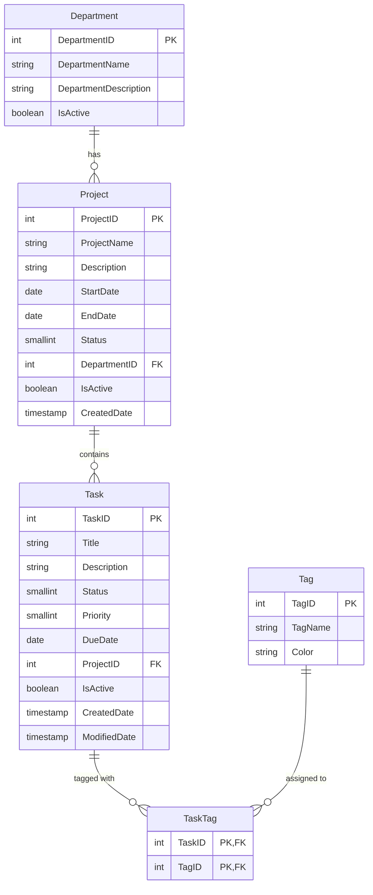

# TaskTrack - Task & Team Management Web Application

> **PRN232 Practical Exam 1 (Assignment 1)**  
> **Tech Stack**: ASP.NET Core Web API (.NET 8) | PostgreSQL | Next.js (App Router, TypeScript, Tailwind CSS)  
> **Repository**: [https://github.com/Phamtin147/prn232-ass1](https://github.com/Phamtin147/prn232-ass1)

---

## 🏛 Architecture & Monorepo Structure

```text
prn232-ass1/
├── backend/
│   ├── TaskTrack.sln
│   ├── TaskTrack.API/        # Web API (.NET 8), Controllers, Swagger, Program.cs
│   ├── TaskTrack.Repo/       # EF Core Npgsql, DbContext, Models, Repositories
│   └── TaskTrack.Service/    # Business services, DTOs, validations
├── frontend/                 # Next.js 14+ App Router, TypeScript, Tailwind CSS
│   ├── app/                  # Public pages & /manage CRUD pages
│   ├── components/           # Badges, Modals, ConfirmDialog, Toast, Navbar
│   └── lib/                  # API client, types, status & priority constants
├── database/
│   └── TaskManagementDB_Postgres.sql # Complete schema & initial seeds
├── .github/
│   └── workflows/ci.yml      # CI pipeline building .NET 8 & Next.js
├── StudentID_ClassCode_Ass1.docx # Submission report document
├── .env.example              # Environment variables template
└── README.md
```

---

## 📊 Database Schema & ERD Diagram



---

## 🚀 Key Features

### 1. Backend RESTful API (ASP.NET Core .NET 8)
- **3-Tier Architecture**: Clean separation between `API`, `Service`, and `Repo`.
- **Database-First EF Core** mapped to PostgreSQL.
- **Strict Business Constraints**:
  - `DELETE /api/departments/{id}`: Blocked if projects exist (HTTP 400).
  - `DELETE /api/projects/{id}`: Blocked if tasks exist (HTTP 400).
  - `DELETE /api/tags/{id}`: Blocked if associated with any task (HTTP 400).
  - `DELETE /api/tasks/{id}`: Soft-delete only (`IsActive = false`).
  - `PUT /api/tasks/{id}`: Replaces tags and sets `ModifiedDate = UtcNow`.
- **Swagger UI**: Accessible at the root URL `/`.
- **CORS**: Configured to accept incoming requests from all origins (including Vercel deployment).
- **Environment Auto-detection**: Parses `DATABASE_URL` (Render style `postgres://...`) or standard connection string.

### 2. Modern Frontend (Next.js App Router + TypeScript)
- **Public Pages**:
  - `/`: Overview banner, live counters, cards of active projects.
  - `/departments`: Grid of active departments.
  - `/departments/[id]`: Department details and associated projects.
  - `/projects/[id]`: Project details, timeline, task list with colored status/priority badges, and status filter tabs.
  - `/tasks/[id]`: Full task view with description, dates, project name, and tags.
  - `/search`: Real-time multi-filter task search (title, status, priority, project, tag).
- **Management CRUD Pages**:
  - `/departments/manage`: Create, Edit modal, Delete with dependency guard.
  - `/projects/manage`: Create, Edit modal, Delete with task guard.
  - `/tasks/manage`: Create, Edit modal with multi-select tag picker, Soft-delete dialog.
  - `/tags/manage`: Create, Edit modal with hex color picker, Delete guard.
- **UI/UX Excellence**: Toast notifications, colored badges, confirmation modals, responsive layout.

---

## 🛠 Local Setup & Running

### 1. Database
Run PostgreSQL and execute `database/TaskManagementDB_Postgres.sql`:
```bash
# Using Docker
docker run --name pg-tasktrack -e POSTGRES_PASSWORD=postgres -e POSTGRES_DB=TaskManagementDB -p 5432:5432 -d postgres:16-alpine
docker exec -i pg-tasktrack psql -U postgres -d TaskManagementDB < database/TaskManagementDB_Postgres.sql
```

### 2. Backend
```bash
cd backend
dotnet restore
dotnet run --project TaskTrack.API/TaskTrack.API.csproj
# API will run on http://localhost:5000 (Swagger at http://localhost:5000)
```

### 3. Frontend
```bash
cd frontend
npm install
npm run dev
# App will run on http://localhost:3000
```

---

## 🌐 Deployment Instructions

### A. Database on Render.com
1. Create a free **PostgreSQL Database** on Render.
2. Connect to the instance using any PostgreSQL client (e.g. `psql` or DBeaver) and run `database/TaskManagementDB_Postgres.sql`.
3. Copy the **Internal Database URL** or **External Database URL**.

### B. Backend on Render.com
1. Create a new **Web Service** on Render connected to `https://github.com/Phamtin147/prn232-ass1`.
2. Configure:
   - **Branch**: `main`
   - **Root Directory**: `backend`
   - **Runtime**: Docker or .NET (Build Command: `dotnet publish TaskTrack.API/TaskTrack.API.csproj -c Release -o out`, Start Command: `./out/TaskTrack.API`).
3. Add Environment Variable:
   - `DATABASE_URL`: `<your-render-postgresql-url>`
   - `ASPNETCORE_ENVIRONMENT`: `Production`

### C. Frontend on Vercel
1. Import repository `https://github.com/Phamtin147/prn232-ass1` into Vercel.
2. Configure:
   - **Framework Preset**: `Next.js`
   - **Root Directory**: `frontend`
3. Add Environment Variable:
   - `NEXT_PUBLIC_API_URL`: `<your-render-backend-url>` (e.g. `https://tasktrack-api.onrender.com`)
4. Deploy!
